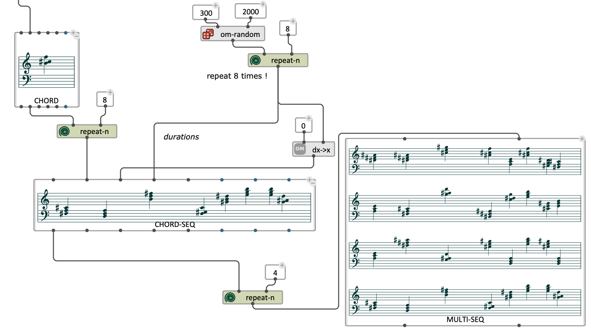
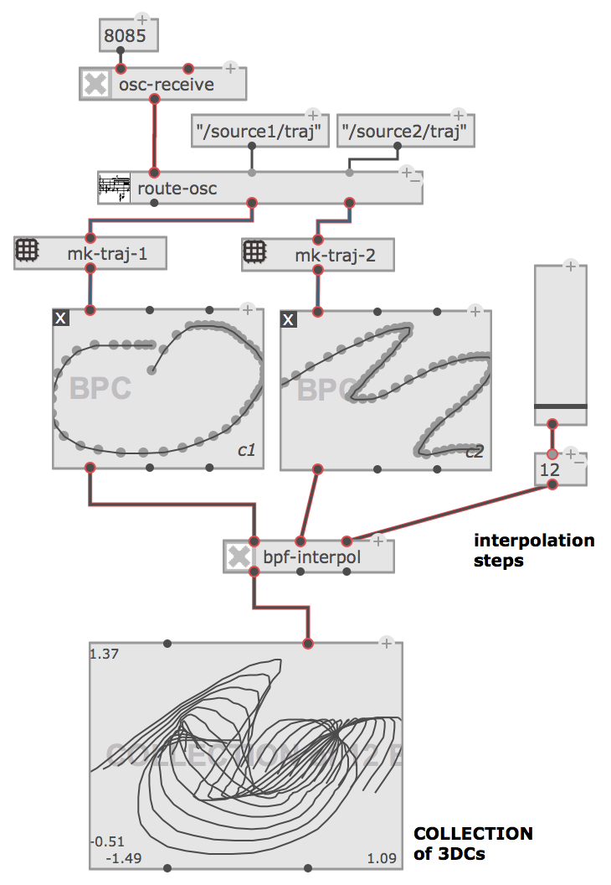
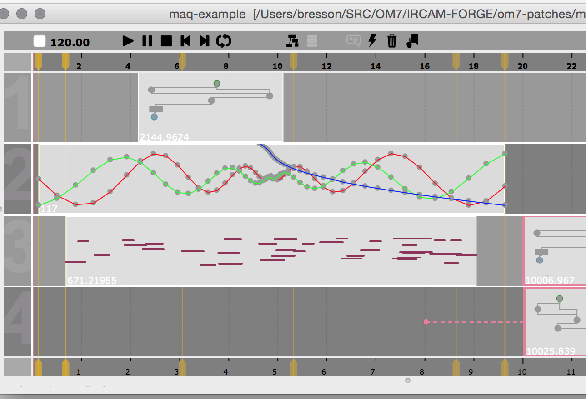
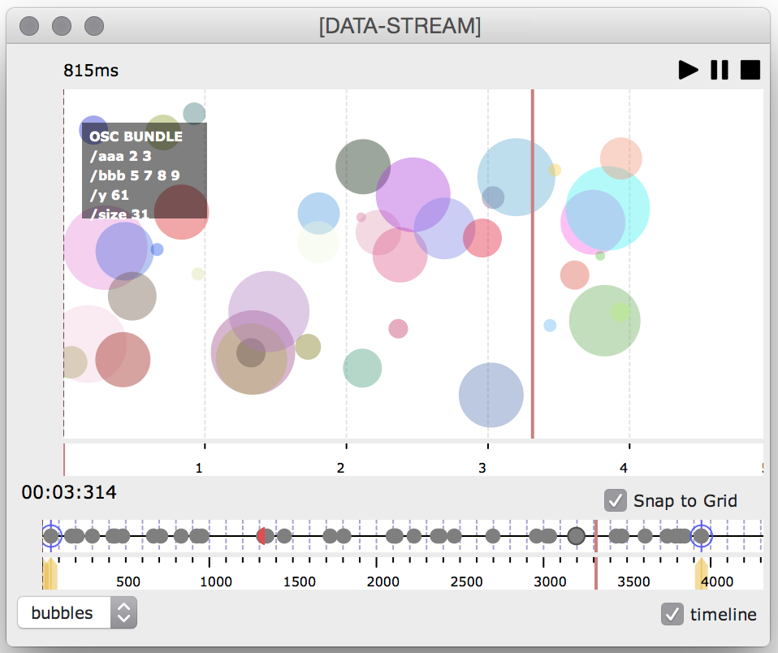
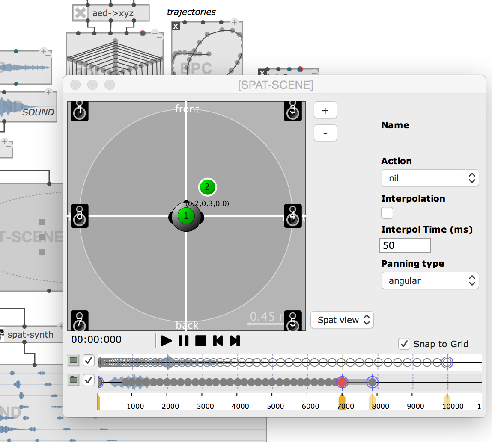

[OpenMusic](http://repmus.ircam.fr/openmusic/) (OM) is a visual programming language based on [Common Lisp](http://www.gigamonkeys.com/book/introduction-why-lisp.html). Visual programs are created by assembling and connecting icons representing Lisp functions and data structures, built-in control structures (e.g. loops), and other program constructs.
OM may be used as a general purpose functional/object/visual programming language. Existing CommonLisp/CLOS code can easily be used in OM, and new code can be developed in a visual way.
At a more specialized level, a set of classes and libraries make it a powerful environment for music composition. Various classes implementing musical structures are provided. They are associated with graphical editors and may be extended by the user to meet specific needs. Different in-built representations and structures include common music notation, MIDI, OSC, 2D/3D curves, and audio buffers. 

OM7 is a new generation of the OpenMusic language, currently under development, including radical improvements and changes in graphical interface, computational features, and connection to external software libraries. 

See the <a href="https://hal.archives-ouvertes.fr/hal-01567619" target="_blank">this paper (2017) about OM7</a>.

<!---->

<!--

-->

