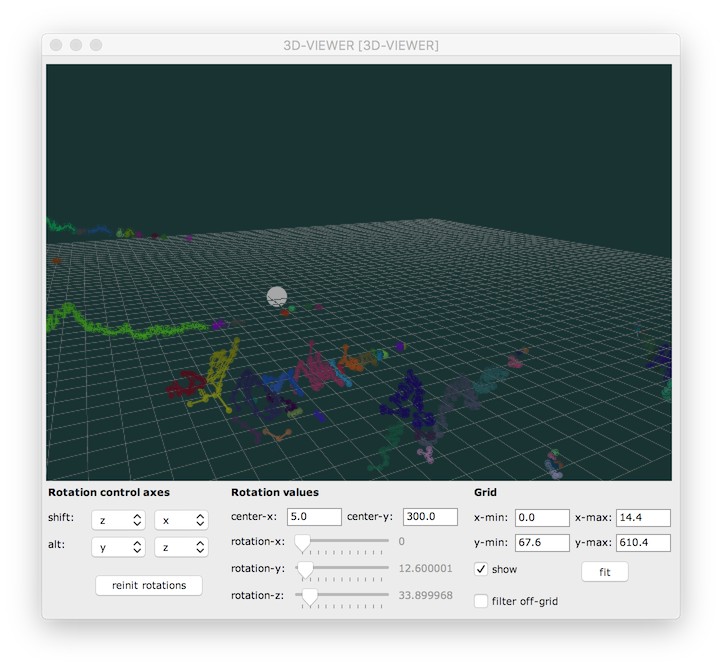
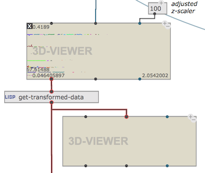

### 3D-Viewer

3D-viewer is an object allowing for the visualization and editing of a set of 3D-objects.

Currently-supported 3D objects are: **3D-LINES**, **3D-CUBE** and **3D-SPHERE**.

The main editing consists in 3D-rotations along different combinations of axes.

_Note: for the simple visualization of 3D trajectories, the **3DC** object (eventually in a **COLLECTION** object) might be easier to use._

### Viewpoint 

Modify the view point by using the mouse "click-and-drag". 

###### Viewpoint short-cuts

- **\+** : Zoom in
- **\-** : Zoom out
- **esc** : Reinitialize viewpoint
- **c** : Change background color

### Rotation

Rotate the data using the slider on the editor GUI, or use the mouse "click-and-drag" + _SHIFT_ or _ALT_ key pressed.
The editor GUI allow to configure the rotation axes according to the _SHIFT_ / _ALT_ keys.

Click-drag or double-click on the _center-x_ and _center-y_ frames to set the center of the rotation.

###### Rotation short-cuts:
- ← → ↑ ↓ : move the center of rotation in the x/y plane
- **o** : Reinitialize rotations
- **shift+O** : Reinitialize rotation center

### How to use it...

- Use additional inputs of the 3D-viewer box to set the rotation values, some scaling factor(s) and/or grid parameters from the OM patch.

- Use the function **get-transformed-data** to output the transformed data out of the viewer in an OM patch. 

- If _filter-off-grid_ is on, the data out of the grid will not be exported in **get-transformed-data**.

NB: Press _Space_ in the editor to activate a reactive notification in the box. 
This will output transformed data out in the patch and update downstream reactive connected boxes.

