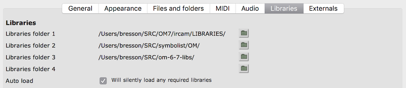
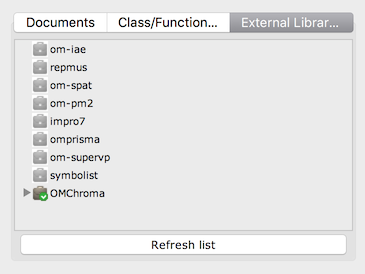
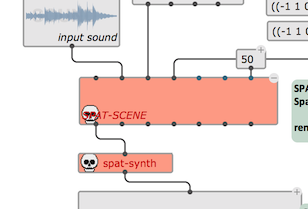

# external libraries

This page describes how to install and use external libraries in om7.

External libraries contain extra code and features that can be loaded in om7 after staring it up.
They must be located in specific folders where om7 can find them.

Set one or several locations in the **Library** tab of the om7 _Preferences_ window:

Open the main _Workspace/Libary_ window's tab for **External Libraries** to see which libaries are currently detected by om7. Notice the different icons for libraries that are loaded, and not loaded:

If you make a change in the libraries installed while OM is running, use the **Refresh list** button to update this general view.

#### Loading a library

Just double click on the library icon to load (or re-load) a library.

#### Patches requiring libraries

Patches created with objects or functions froma given library will need this library to be installed in order to run and display correctly. If the library is insrtalled but not loaded at opening such library-dependent patcvh, a prompt will open proposing you to load the library (except if the Preferences option _Auto load_ is on).

If the library is not loaded or not found the corresponding boxes will be temporarily disabled, and display in red in the patch:

If the library is loaded or updated after that, use the command **Revert (Last Saved)** from the file menu to reload the patch from the disk. 

