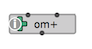
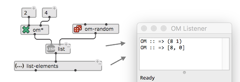

# basics of patching

------

### Patch

A patch is a visual program: the graphical equaivalent to a Lisp expression (or set of expressions).

It contains boxes connected together via patch cords (also simply called **connections**).

Boxes can represent either **Lisp functions**, other **embedded or external visual programs** (sub-patches), **simple values** or **object constructors**.

A patch can also include inputs and outputs (to receive arguments or return values when it is embedded in another patch), textual comments, and specific _active_ components (e.g. buttons, sliders etc.) used to set values as arguments of other boxes.

_Use CMD+N to open a new patch window. See [Managing documents]() for more info on opening/saving/managing patches._

------

### Boxes

A box is a rectangle displaying a name (generally, the name of the function, object or embedded component it is referring to), an icon (sometimes) and a number of inlets and outlets.
**Inlets** (at the top) represent inputs of the function call. They corresponds to the _arguments_ of a function or embedded sub-patch, or the _attributes_ of an object constructor (see [Object boxes](objects)).
**Outlets** represent the returned value(s).

The boxes have a number of "active" areas, changing their appearance or the mouse cursor when dragged over:
- Resize areas at the right and bottom borders (when the box is resizable)

- Inputs and outputs (displaying tooltips: name, value and short documentation) 

 

- Info area (at the left) displaying an ``info'' button (see [Inspector and Box Attributes](inspector)) 

 

- Add/remove input buttons (when available) — see below.

##### Create a Box 

- Type _**N**_ or double click anywhere on teh patch editor background to create a function or object box.\\
In the temporary text field, type the name of the object you wish to add in the patch, then press **ENTER**.

###### 	Auto-completion

- After typing the first letters of the object name, use the ↓ (down-arrow) key to activate **auto-completion** with all registered object names. Use ↓ and ↑ to navigate in the list, **ENTER** to validate your choice or **ESC** to exit.

###### 	Notes

- The list of main OM predefined functions is available in the main _Workspace/Library window_ (CMD+SHIFT+W), under the _Class/Function Library_ tab. They are also listed and documented in the reference pages (CMD+D or _Help_ menu → _Function/Class Reference_ )

- **Any Lisp function can be used** and connected to other boxes in a patch.\\
However, only a subset of pre-registered functions are visible in the function library and auto-completion list.  

##### Move a Box

Boxes can be dragged on the patch editor, and/or from one editor window to another.

Alternatively, the arrow keys ← → ↑ ↓ also move selected boxes. 
SHIFT+← → ↑ ↓ performs faster moves.

##### Delete a Box

They can be deleted using the **BACKSPACE** key.

##### Get Documentation

Use the _Help_ menu → _Function/Class Reference_ or the CMD+D shortcut to open the auto-generated HTML reference documentation page of a function or object box.  

------
### Box inputs

Values of the box inputs can be set "by hand" by just clicking on the input and typing a simple value.

**Note:** SHIFT+click on the input will automatically create a simple value box connected to the input (see [Simple value boxes](value-box)).

 

Boxes with a small "**+**" icon at the top-left corner have hidden optional inputs. 
When such inputs are visible, they can be removed with the other small "**–**" button.

 

There exist two types of additional inputs, which correspond to different existing types of arguments of Lisp functions.

------
##### Optionals

**Optional** box inputs correspond to the Lisp _&optional_ or _&rest_ constructs.
They represent an fix-ordered sequence of additional arguments. 
Added optional inputs can be inspected and used just as other inputs.

 

**Note:** Alternative shortcuts for adding/removing optional inputs are ALT+→ / ALT+← or **>** / **<**.

------
##### Keywords

**Keyword** box inputs are additional inputs which must be 1) named and 2) set by the user beforehand.

The list of available keywords is accessed by clicking the input. 
By default keywords are added in the order of the list, but they can be renamed and interchanged anytime.
As compared to optional inputs, this mechanisms prevents for instance from displaying all the additional inputs when only the last one is to be used.

 

Once the name of the keyword input is selected, it's value can be set either by connecting a value to it (see next section) or (in some cases where the number of possible value is small and finite) via a second embedded menu:

 

**Note:** Alternative shortcuts for adding/removing keyword inputs are **K** / SHIFT+**K**.

------

### Evaluation

**Evaluation is the essential mecanism of program execution in OM.**
Evaluating a box means requesting it to compute a value by applying a finction to it's inputs. When the inputs are connected, the evaluation propagates to upstream connected boxes, until all requested values allow the computation of the box.

Use the **V** shortcut to evaluate the slected box(es) in the patch.

When the evaluation terminates, the result is oprinted in the main OM Listener (see [Listener](listener)). USe CMD+SHIFT+**L** if the Listener window is not visible. 

 

**Note**: Boxes with multiple outputs are called "multivalued". Their result is displayed in the Listener as a list of values separated by comas.

 

_**list** outputs a single "value": the list (0 8). **list-elements** outputs two separate values (0 and 8)._

Alternatively: 

- **CMD+click** on a box output to evaluate the box and print the value of this particular output.
- **CMD+SHIFT+click** on a box output to evaluate the box materialize the output as a new box.

------
##### Lock state / evaluation mode.

Boxes can be set in special _states_ determining their behaviour at evaluation.
The state can be set using keyboard shortcuts or from the box [inspector](inspector).

For now, we will say that the box can be locked / unlocked with **B**:\\
**When a box is locked, no evaluation occurs and the box just returns its current (last-computed) value.**

 

See more in [Evaluation Modes](eval-modes).

------

### Connections

The main procedure to set the value of a function or objec box is to connect it to another box's output.
This is how functions are composed, and visual programs are built in OM.

In order to create a connection, use the mouse to drag from a box's output to another box's input.
If the connection si allowed (for instance, cycles are not permitted and inconsistent with the visual language semantics), the connection line will appear in the patch.

 

Existing connections can be selected with the mouse, re-routed (e.g. for readability) with "mouse drag", or deleted (using the **Backspace** key).

 

**Note**: After dragging it, use the **I** shortcut to rest the shape of a connection back to normal.

**Clicking** on a connected input allows to unconnect it, keep the connection at hand and re-connect it somewhere else.

 

**SHIFT+clicking** on a connected input removes its connection (remember that SHIFT+clicking again on an unconnected input pops out its value as a box and connects it).

Two shortcuts allo to auto-connect a number of selected boxes together:

- **C** follows left-to-right order in finding matches to the inputs of the bottom-most box: if several other boxes are selected, by trying to connect the different box to the successive outputs, or if only one other box is selected, by matching its outputs to the bottom box inputs.

 

- SHIFT+**C** follows a bottom-to-top approach trying to cascade all selected boxes from first outputs to first inputs.

 

The inspecor (CMD+**I**) of selected connections also allows to set their color and shape (see [Inspector and Box Attributes](inspector)) 

 

------
### Basic commands and manipulations

The _Select all..._ command from the **Edit** menu (CMD+**A**) selects everything in the patch window.

##### Copy-Paste

- The **Edit** menu provides the standard Copy / Cut / Paste commands.

- Boxes can also be copied and pasted using the standard ALT+drag (as for files in macOS Finder).

All these operations perfom on a same editor, or from one editor window to another.

##### Undo/Redo

Use the standard CMD+**Z** / CMD+SHIFT+**Z** in order to undo/redo your last editing operations.

##### Align Boxes

- The _Align boxes_ command (CMD+SHIFT+**A**) from the **Edit** menu automatically adjusts the box layout to align positions of neighbour boxes and inputs vs. outputs. 

##### Initialize

- The **I** shortcut reinitializes the box state (mostly, its size) to the default configuration.

- SHIFT+**I** reinitializes the box value – this will be useful essentially for object boxes (see [Object boxes](objects))

------
##### Lock the Patch

 

This little icon at the top of the patch window, or the command _Edit lock_ (CMD+**E**) in the **Edit** menu lock/unlock the whole patch editor.

A locked patch can not be edited (most commands are disabled) but only evaluated.

------
### Comments

Create comments in a patch using the shortcut **C**, then type a text in the editablme box. 

Comments are not involved in patch evaluations but can document your programs. 

You can resize, move, copy, delete them and edit their appearance and attributes as any other boxes. 

 

